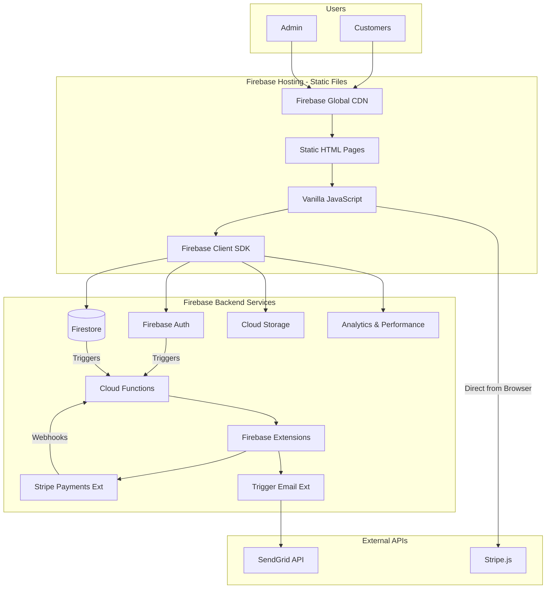
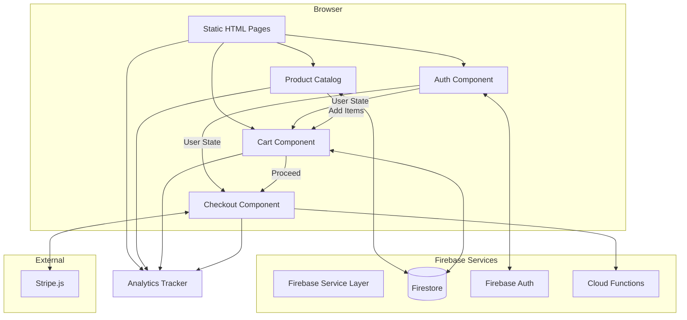
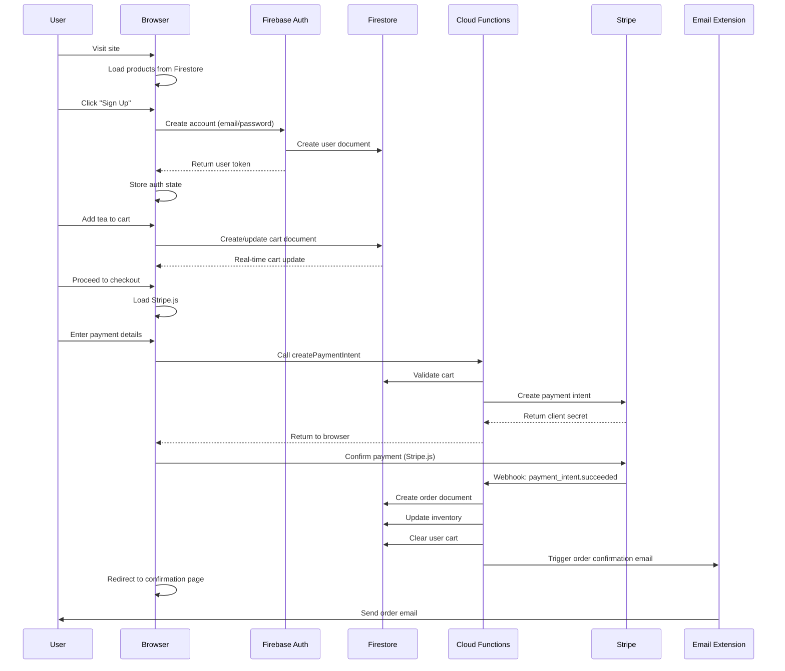
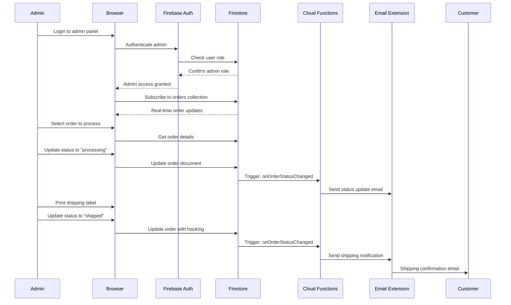
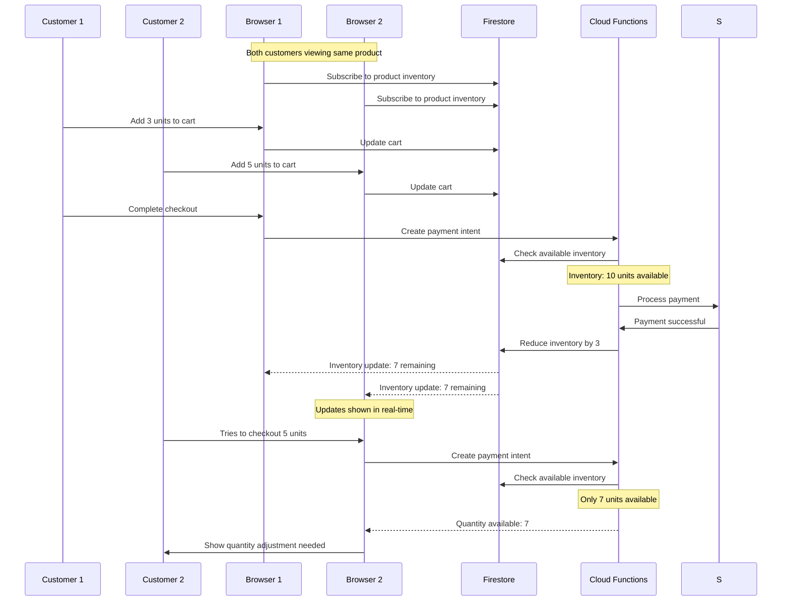
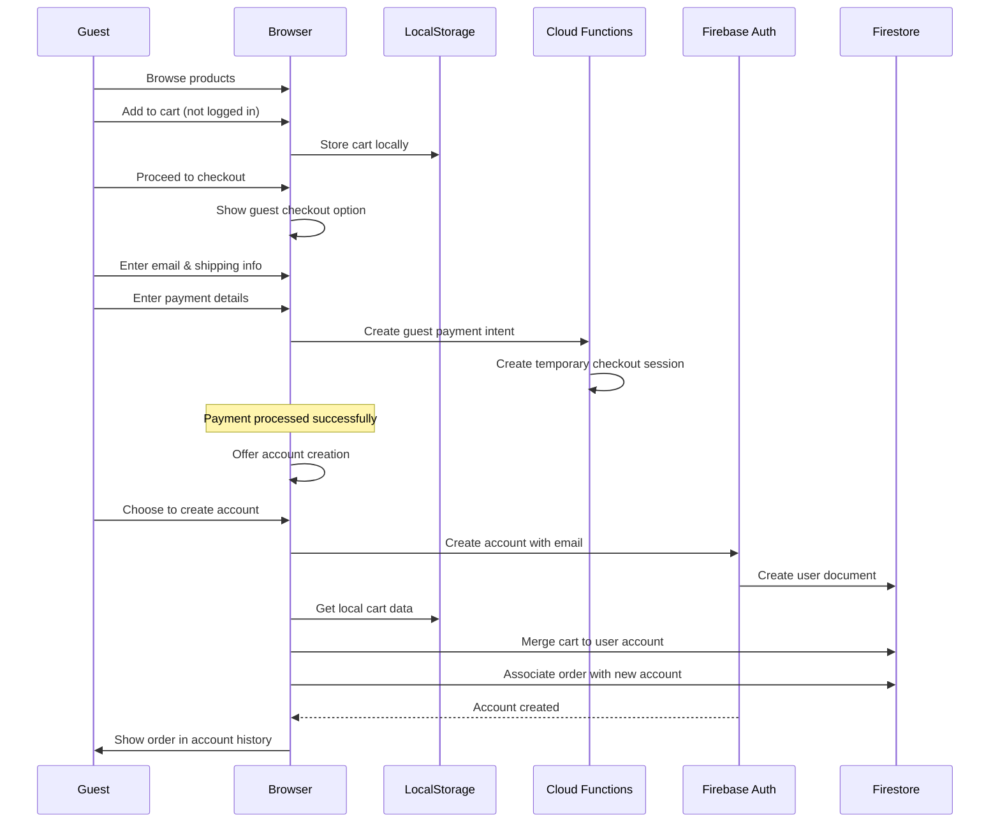
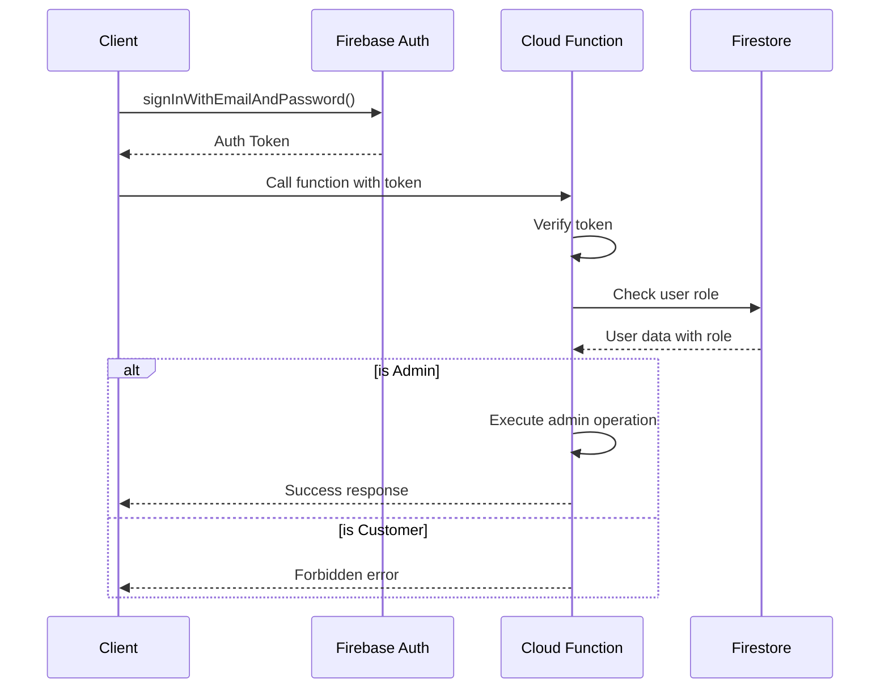

# Vita-Tea MVP Fullstack Architecture Document

## Introduction

This document outlines the complete fullstack architecture for the Vita-Tea MVP - a Firebase-powered wellness tea e-commerce platform targeting rapid market entry with 50+ orders in month 1. 

The architecture prioritizes:
- **Speed to Market**: Firebase ecosystem for accelerated development
- **MVP Focus**: Pragmatic choices over perfect solutions
- **Scalability Path**: Foundation that supports future AI agent integration
- **Operational Excellence**: Built-in analytics for achieving 200+ orders by month 3
- **AI-Driven Development**: Optimized for Claude and other AI agents to implement

This unified fullstack approach ensures consistency across the entire technology stack while maintaining the flexibility to evolve from MVP to the advanced AI-powered platform envisioned in the business brief.

### Starter Template or Existing Project

N/A - Greenfield project

### Change Log

| Date | Version | Description | Author |
|------|---------|-------------|---------|
| 2025-08-26 | v1.0 | Initial fullstack architecture document | Winston (Architect) |

## High Level Architecture

### Technical Summary

The Vita-Tea MVP adopts a pure serverless, static-first architecture using vanilla HTML/CSS/JavaScript deployed directly to Firebase Hosting. The platform leverages the complete Firebase ecosystem including Authentication, Firestore, Cloud Storage, Analytics, and Cloud Functions, with Firebase Extensions for Stripe payments and transactional emails. This ultra-simplified architecture enables deployment within minutes and rapid iteration, perfectly aligned with the 8-10 week timeline and 50+ orders goal, while eliminating build complexity and reducing potential points of failure.

### Platform and Infrastructure Choice

Based on PRD requirements and MVP goals, here's the platform analysis:

**Selected Platform: Firebase Platform (All-in-one)**

**Rationale**: 
- Zero build step = faster development and deployment
- Static hosting with CDN included
- All Firebase services accessible via client SDK
- Generous free tier perfect for MVP launch
- Firebase Extensions eliminate custom backend code

**Key Services:**
- Firebase Hosting (static files + CDN)
- Firestore (multi-region for reliability)
- Authentication (Email/Password + Google)
- Cloud Functions (payment processing, order fulfillment)
- Cloud Storage (product images, assets)
- Firebase Analytics & Performance Monitoring
- Firebase Extensions:
  - Trigger Email with SendGrid
  - Run Stripe Payments
  - Resize Images

**Deployment Host and Regions:** 
- Hosting: Global CDN via Firebase
- Functions: us-central1
- Firestore: Multi-region (nam5) for 99.999% availability

### Repository Structure

**Structure:** Single Repository (MVP-optimized)
**Build Tool:** None - Pure static files
**Package Organization:**
```
vita-tea-mvp/
├── public/               # All static files served by Firebase
│   ├── index.html       # Homepage
│   ├── shop.html        # Product catalog
│   ├── product.html     # Product detail page
│   ├── cart.html        # Shopping cart
│   ├── checkout.html    # Checkout flow
│   ├── admin/           # Admin pages
│   │   ├── index.html   # Admin dashboard
│   │   ├── orders.html  # Order management
│   │   └── inventory.html # Inventory management
│   ├── css/
│   │   ├── main.css     # Main styles (Tailwind via CDN)
│   │   └── admin.css    # Admin-specific styles
│   ├── js/
│   │   ├── app.js       # Main application logic
│   │   ├── firebase-config.js # Firebase initialization
│   │   ├── auth.js      # Authentication logic
│   │   ├── products.js  # Product catalog logic
│   │   ├── cart.js      # Cart management
│   │   ├── checkout.js  # Checkout flow
│   │   └── components/  # Reusable JS components
│   │       ├── product-card.js
│   │       └── cart-item.js
│   └── assets/          # Images, fonts, etc.
├── functions/           # Cloud Functions
│   ├── src/
│   │   ├── index.ts     # Function exports
│   │   ├── stripe.ts    # Stripe webhook handlers
│   │   └── admin.ts     # Admin API endpoints
│   └── package.json
├── firestore.rules      # Security rules
├── storage.rules        # Storage security rules
├── firebase.json        # Firebase configuration
└── .firebaserc         # Project configuration
```

### High Level Architecture Diagram



### Architectural Patterns

- **Static-First Architecture:** Pure HTML/CSS/JS with no build step - _Rationale:_ Instant deployments, zero configuration, maximum simplicity
- **Direct Firebase SDK Integration:** Client-side Firebase operations with security rules - _Rationale:_ Real-time updates, minimal backend code
- **Progressive Enhancement:** Basic HTML works without JS, enhanced with JS - _Rationale:_ Better accessibility and SEO
- **Web Components:** Vanilla JS custom elements for reusability - _Rationale:_ Native browser API, no framework needed
- **Event-Driven Background Tasks:** Cloud Functions for async operations - _Rationale:_ Handle payments and fulfillment server-side
- **Security Rules as Business Logic:** All access control in Firestore rules - _Rationale:_ Declarative security, no custom auth code

## Tech Stack

This is the DEFINITIVE technology selection for the entire project. All development must use these exact versions:

### Technology Stack Table

| Category | Technology | Version | Purpose | Rationale |
|----------|------------|---------|---------|-----------|
| Frontend Language | JavaScript (ES6+) | Modern | Client-side logic | No build step, native browser support |
| Frontend Framework | Vanilla JS | N/A | No framework | Maximum simplicity, zero dependencies |
| UI Component Library | Web Components | Native | Reusable components | Native browser API, no framework needed |
| UI Enhancement | Alpine.js | 3.x | Declarative reactivity | 15KB, no build step, HTML-first |
| Backend Language | TypeScript | 5.3+ | Cloud Functions only | Type safety for critical backend code |
| Backend Framework | Firebase Functions | 4.9+ | Serverless functions | Payment processing, admin operations |
| API Style | Client SDK + Functions | N/A | Hybrid approach | Direct Firestore access + secure operations |
| Database | Firestore | latest | NoSQL document database | Real-time, scalable, managed |
| Cache | Browser Cache | Native | Static asset caching | Service worker for offline support |
| File Storage | Cloud Storage | latest | Media storage | Product images with CDN |
| Authentication | Firebase Auth | latest | User authentication | Email/password + Google OAuth |
| Frontend Testing | None (MVP) | N/A | Manual testing initially | Focus on shipping, add tests post-launch |
| Backend Testing | Jest | 29+ | Functions testing | Firebase emulator for critical paths |
| E2E Testing | Manual + GA | N/A | User testing | Real user data via Analytics |
| Build Tool | None | N/A | No build process | Direct file serving |
| Bundler | None | N/A | No bundling | ES6 modules for organization |
| IaC Tool | Firebase CLI | 13.0+ | Infrastructure deployment | firebase.json configuration |
| CI/CD | GitHub Actions | N/A | Simple deployment | firebase deploy on push |
| Monitoring | Firebase Analytics | latest | User behavior tracking | Conversion funnel optimization |
| Logging | Console + Cloud | latest | Simple logging | Browser console + Cloud Functions logs |
| CSS Framework | Tailwind CSS | 3.4+ CDN | Utility-first CSS | Via CDN, no build required |

## Data Models

Based on the PRD requirements and e-commerce needs, here are the core data models:

### User

**Purpose:** Represents authenticated users including customers and admins

**Key Attributes:**
- uid: string - Firebase Auth UID
- email: string - User email address
- displayName: string - User's display name
- role: 'customer' | 'admin' - User role
- createdAt: timestamp - Account creation date
- updatedAt: timestamp - Last update timestamp
- lastLoginAt: timestamp - Last login timestamp
- preferences: UserPreferences - User settings

**TypeScript Interface:**
```typescript
interface User {
  uid: string;
  email: string;
  displayName: string;
  role: 'customer' | 'admin';
  createdAt: Timestamp;
  updatedAt: Timestamp;
  lastLoginAt: Timestamp;
  preferences: UserPreferences;
}

interface UserPreferences {
  marketingEmails: boolean;
  orderNotifications: boolean;
}
```

**Relationships:**
- Has many Orders
- Has many Addresses
- Has one Cart

### Product

**Purpose:** Represents tea products available for purchase

**Key Attributes:**
- productId: string - Unique product identifier
- name: string - Product name
- slug: string - URL-friendly identifier
- description: string - Product description
- category: 'digestive' | 'stress-relief' | 'immunity' - Product category
- price: number - Price in cents
- images: string[] - Array of image URLs
- inventory: number - Available stock
- isActive: boolean - Product availability
- metadata: ProductMetadata - Additional product info

**TypeScript Interface:**
```typescript
interface Product {
  productId: string;
  name: string;
  slug: string;
  description: string;
  category: 'digestive' | 'stress-relief' | 'immunity';
  price: number; // in cents
  images: string[];
  inventory: number;
  isActive: boolean;
  metadata: ProductMetadata;
  createdAt: Timestamp;
  updatedAt: Timestamp;
}

interface ProductMetadata {
  ingredients: string[];
  brewingInstructions: string;
  healthBenefits: string[];
  caffeineLevel: 'none' | 'low' | 'medium' | 'high';
}
```

**Relationships:**
- Belongs to many Orders (via OrderItems)
- Has many InventoryLogs

### Order

**Purpose:** Represents customer orders

**Key Attributes:**
- orderId: string - Order ID
- orderNumber: string - Human-readable order number
- userId: string - Customer UID
- status: OrderStatus - Order status
- items: OrderItem[] - Order line items
- subtotal: number - Subtotal in cents
- tax: number - Tax amount in cents
- shipping: number - Shipping cost in cents
- total: number - Total amount in cents
- shippingAddress: Address - Delivery address
- stripePaymentIntentId: string - Stripe payment reference
- estimatedDeliveryAt: timestamp - Expected delivery date

**TypeScript Interface:**
```typescript
interface Order {
  orderId: string;
  orderNumber: string; // e.g., "VT-2024-0001"
  userId: string;
  status: OrderStatus;
  items: OrderItem[];
  subtotal: number;
  tax: number;
  shipping: number;
  total: number;
  shippingAddress: Address;
  billingAddress: Address;
  stripePaymentIntentId: string;
  estimatedDeliveryAt?: Timestamp;
  createdAt: Timestamp;
  updatedAt: Timestamp;
}

type OrderStatus = 
  | 'pending'
  | 'processing'
  | 'shipped'
  | 'delivered'
  | 'cancelled'
  | 'refunded';

interface OrderItem {
  productId: string;
  productName: string;
  price: number;
  quantity: number;
  subtotal: number;
}
```

**Relationships:**
- Belongs to User
- Has many OrderItems
- Has many OrderEvents (status changes)

### Cart

**Purpose:** Represents user's shopping cart

**Key Attributes:**
- cartId: string - Cart ID
- userId: string - User's UID
- items: CartItem[] - Cart items
- expiresAt: timestamp - Cart expiration

**TypeScript Interface:**
```typescript
interface Cart {
  cartId: string;
  userId: string;
  items: CartItem[];
  expiresAt: Timestamp;
  createdAt: Timestamp;
  updatedAt: Timestamp;
}

interface CartItem {
  productId: string;
  quantity: number;
  addedAt: Timestamp;
}
```

**Relationships:**
- Belongs to User
- References Products

### Address

**Purpose:** Stores shipping/billing addresses

**Key Attributes:**
- addressId: string - Address ID
- userId: string - User's UID
- type: 'shipping' | 'billing' - Address type
- isDefault: boolean - Default address flag
- line1: string - Street address
- city: string - City
- state: string - State/Province
- postalCode: string - ZIP/Postal code
- country: string - Country code

**TypeScript Interface:**
```typescript
interface Address {
  addressId: string;
  userId: string;
  type: 'shipping' | 'billing';
  isDefault: boolean;
  name: string;
  line1: string;
  line2?: string;
  city: string;
  state: string;
  postalCode: string;
  country: string;
  phone?: string;
  createdAt: Timestamp;
  updatedAt: Timestamp;
}
```

**Relationships:**
- Belongs to User
- Used by Orders

### InventoryLog

**Purpose:** Tracks all inventory changes for audit and fulfillment

**Key Attributes:**
- logId: string - Log entry ID
- productId: string - Product reference
- previousQuantity: number - Quantity before change
- newQuantity: number - Quantity after change
- changeType: 'order' | 'restock' | 'adjustment' - Type of change
- referenceId: string - Related entity ID (orderId, etc.)

**TypeScript Interface:**
```typescript
interface InventoryLog {
  logId: string;
  productId: string;
  previousQuantity: number;
  newQuantity: number;
  changeType: 'order' | 'restock' | 'adjustment';
  referenceId?: string;
  notes?: string;
  createdAt: Timestamp;
  createdBy: string;
}
```

**Relationships:**
- Belongs to Product
- References Orders (when applicable)

### OrderEvent

**Purpose:** Tracks order status changes for customer service and fulfillment

**Key Attributes:**
- eventId: string - Event ID
- orderId: string - Order reference
- previousStatus: OrderStatus - Status before change
- newStatus: OrderStatus - Status after change
- metadata: object - Additional event data

**TypeScript Interface:**
```typescript
interface OrderEvent {
  eventId: string;
  orderId: string;
  previousStatus: OrderStatus;
  newStatus: OrderStatus;
  metadata?: {
    trackingNumber?: string;
    carrier?: string;
    notes?: string;
  };
  createdAt: Timestamp;
  createdBy: string; // system or userId
}
```

**Relationships:**
- Belongs to Order

### AnalyticsEvent

**Purpose:** Tracks user behavior for conversion optimization and achieving order goals

**Key Attributes:**
- eventId: string - Event ID
- sessionId: string - Browser session ID
- userId: string - User ID (if authenticated)
- eventType: string - Type of event
- eventData: object - Event-specific data

**TypeScript Interface:**
```typescript
interface AnalyticsEvent {
  eventId: string;
  sessionId: string;
  userId?: string;
  eventType: 'page_view' | 'product_view' | 'add_to_cart' | 
             'remove_from_cart' | 'checkout_start' | 'checkout_complete' |
             'search' | 'filter_apply';
  eventData: {
    productId?: string;
    searchQuery?: string;
    filterType?: string;
    revenue?: number;
    [key: string]: any;
  };
  deviceInfo: {
    userAgent: string;
    screenSize: string;
    referrer?: string;
  };
  createdAt: Timestamp;
}
```

**Relationships:**
- Optionally belongs to User
- References Products (in eventData)

## API Specification

With our vanilla JavaScript approach, the API surface is minimal. Most operations happen directly through the Firebase Client SDK with security rules enforcement.

### Cloud Functions API

Only critical server-side operations are exposed as Cloud Functions:

```typescript
// functions/src/index.ts

import * as functions from 'firebase-functions';
import { createPaymentIntent, handleStripeWebhook } from './stripe';
import { exportOrders, adjustInventory } from './admin';

// Stripe payment processing
export const stripeCreateIntent = functions.https.onCall(createPaymentIntent);
export const stripeWebhook = functions.https.onRequest(handleStripeWebhook);

// Admin operations (requires admin role)
export const adminExportOrders = functions.https.onCall(exportOrders);
export const adminAdjustInventory = functions.https.onCall(adjustInventory);

// Triggered functions (not callable)
export const onOrderCreated = functions.firestore
  .document('orders/{orderId}')
  .onCreate(async (snap, context) => {
    // Send order confirmation email via Extension
    // Update inventory counts
  });

export const onOrderStatusChanged = functions.firestore
  .document('orders/{orderId}')
  .onUpdate(async (change, context) => {
    // Send status update emails
    // Log state transitions
  });
```

### Client-Side Firebase Operations

All other operations use the Firebase SDK directly from the browser:

```javascript
// public/js/firebase-operations.js

// Product operations (read-only for customers)
async function getProducts() {
  const snapshot = await firebase.firestore()
    .collection('products')
    .where('isActive', '==', true)
    .orderBy('category')
    .get();
  return snapshot.docs.map(doc => ({ id: doc.id, ...doc.data() }));
}

// Real-time cart subscription
function subscribeToCart(userId, callback) {
  return firebase.firestore()
    .collection('carts')
    .doc(userId)
    .onSnapshot(doc => {
      callback(doc.exists ? doc.data() : { items: [] });
    });
}

// Cart operations (user can only modify their own)
async function addToCart(userId, productId, quantity) {
  const cartRef = firebase.firestore().collection('carts').doc(userId);
  return cartRef.set({
    items: firebase.firestore.FieldValue.arrayUnion({
      productId,
      quantity,
      addedAt: firebase.firestore.Timestamp.now()
    }),
    updatedAt: firebase.firestore.Timestamp.now()
  }, { merge: true });
}

// Order history (user can only read their own)
async function getMyOrders(userId) {
  const snapshot = await firebase.firestore()
    .collection('orders')
    .where('userId', '==', userId)
    .orderBy('createdAt', 'desc')
    .limit(10)
    .get();
  return snapshot.docs.map(doc => ({ id: doc.id, ...doc.data() }));
}

// Analytics tracking
async function trackEvent(eventType, eventData) {
  return firebase.firestore().collection('analytics').add({
    eventType,
    eventData,
    sessionId: getSessionId(),
    userId: firebase.auth().currentUser?.uid,
    timestamp: firebase.firestore.Timestamp.now(),
    deviceInfo: {
      userAgent: navigator.userAgent,
      screenSize: `${screen.width}x${screen.height}`
    }
  });
}
```

### Firestore Security Rules

Security is enforced at the database level:

```javascript
// firestore.rules
rules_version = '2';
service cloud.firestore {
  match /databases/{database}/documents {
    // Helper functions
    function isSignedIn() {
      return request.auth != null;
    }
    
    function isOwner(userId) {
      return isSignedIn() && request.auth.uid == userId;
    }
    
    function isAdmin() {
      return isSignedIn() && 
        get(/databases/$(database)/documents/users/$(request.auth.uid)).data.role == 'admin';
    }
    
    // Products - anyone can read, only admin can write
    match /products/{productId} {
      allow read: if true;
      allow write: if isAdmin();
    }
    
    // Carts - users can only access their own
    match /carts/{userId} {
      allow read, write: if isOwner(userId);
    }
    
    // Orders - users read own, admin reads all
    match /orders/{orderId} {
      allow read: if isOwner(resource.data.userId) || isAdmin();
      allow create: if false; // Only Cloud Functions can create
      allow update: if isAdmin(); // Admin can update status
    }
    
    // Analytics - write only (no reads)
    match /analytics/{eventId} {
      allow write: if true;
      allow read: if false;
    }
    
    // Users - read own profile, admin reads all
    match /users/{userId} {
      allow read: if isOwner(userId) || isAdmin();
      allow update: if isOwner(userId) && 
        request.resource.data.role == resource.data.role; // Can't change own role
    }
  }
}
```

### Stripe Integration

Stripe.js is loaded directly in the browser for PCI compliance:

```javascript
// public/js/checkout.js
const stripe = Stripe('pk_live_...');

async function processPayment(cartData) {
  // 1. Call Cloud Function to create payment intent
  const { data } = await firebase.functions()
    .httpsCallable('stripeCreateIntent')({
      cartId: firebase.auth().currentUser.uid
    });
  
  // 2. Use Stripe.js to handle payment
  const { error } = await stripe.confirmCardPayment(data.clientSecret, {
    payment_method: {
      card: cardElement,
      billing_details: { name, email }
    }
  });
  
  if (!error) {
    // Payment successful, order created by webhook
    window.location.href = `/order-confirmation.html?order=${data.orderId}`;
  }
}
```

## Components

Based on our vanilla JavaScript architecture, here are the major logical components:

### Static Pages

**Responsibility:** Core HTML pages for the e-commerce experience

**Key Interfaces:**
- Load Firebase SDK and initialize app
- Import relevant JavaScript modules
- Provide semantic HTML structure

**Dependencies:** Firebase SDK, Tailwind CSS (CDN), Alpine.js (CDN)

**Technology Stack:** HTML5, ES6 modules, Progressive Enhancement

### Firebase Service Layer

**Responsibility:** Centralized Firebase operations and state management

**Key Interfaces:**
- `initializeFirebase()` - App initialization
- `getCurrentUser()` - Auth state
- `subscribeToAuth()` - Auth state changes
- `getFirestore()` - Database reference

**Dependencies:** Firebase SDK modules

**Technology Stack:** JavaScript ES6 modules, Firebase v9 modular SDK

### Authentication Component

**Responsibility:** Handle user authentication flows

**Key Interfaces:**
- `signInWithEmail(email, password)`
- `signInWithGoogle()`
- `signUp(email, password, displayName)`
- `signOut()`
- `onAuthStateChanged(callback)`

**Dependencies:** Firebase Auth, UI notification system

**Technology Stack:** Firebase Auth SDK, vanilla JS event handlers

### Product Catalog Component

**Responsibility:** Display and filter tea products

**Key Interfaces:**
- `loadProducts()` - Fetch active products
- `filterByCategory(category)` - Filter products
- `renderProductGrid(products)` - Display products
- `subscribeToInventory()` - Real-time stock updates

**Dependencies:** Firestore, Product Card component

**Technology Stack:** Vanilla JS, Web Components for product cards

### Shopping Cart Component

**Responsibility:** Manage cart state and operations

**Key Interfaces:**
- `addToCart(productId, quantity)`
- `updateCartItem(productId, newQuantity)`
- `removeFromCart(productId)`
- `getCartTotal()` - Calculate totals
- `subscribeToCart()` - Real-time cart sync

**Dependencies:** Firestore, Local Storage (for guests)

**Technology Stack:** Alpine.js for reactivity, Firestore real-time listeners

### Checkout Component

**Responsibility:** Handle payment processing flow

**Key Interfaces:**
- `initializeStripe()` - Load Stripe.js
- `createPaymentIntent()` - Call Cloud Function
- `confirmPayment()` - Process payment
- `saveShippingAddress()` - Store address

**Dependencies:** Stripe.js, Cloud Functions, Address validation

**Technology Stack:** Stripe Elements, Firebase Functions SDK

### Admin Dashboard

**Responsibility:** Order and inventory management

**Key Interfaces:**
- `loadOrders(filters)` - Fetch orders
- `updateOrderStatus(orderId, status)`
- `adjustInventory(productId, adjustment)`
- `exportOrders()` - Generate CSV

**Dependencies:** Admin Cloud Functions, Firestore

**Technology Stack:** Vanilla JS, HTML tables, Alpine.js for interactivity

### Analytics Tracker

**Responsibility:** Track user behavior and conversions

**Key Interfaces:**
- `trackPageView(page)`
- `trackEvent(eventType, eventData)`
- `trackConversion(orderId, revenue)`
- `getSessionId()` - Maintain session

**Dependencies:** Firebase Analytics, Custom analytics collection

**Technology Stack:** Firebase Analytics SDK, Firestore for custom events

### Component Interaction Diagram



## External APIs

Based on the PRD requirements and our vanilla JS architecture, here are the external API integrations:

### Stripe API

- **Purpose:** Payment processing for tea purchases
- **Documentation:** https://stripe.com/docs/api
- **Base URL(s):** Client-side via Stripe.js
- **Authentication:** Publishable key (client), Secret key (server)
- **Rate Limits:** No strict limits for normal usage

**Key Endpoints Used:**
- Client-side: Stripe Elements, Payment Intents (via Stripe.js)
- Server-side webhooks: `POST /stripe/webhook` - Payment confirmations

**Integration Notes:** 
- Use Firebase Extension "Run Payments with Stripe" for simplified integration
- Stripe.js handles PCI compliance by tokenizing cards client-side
- Webhooks secured with signature verification

### SendGrid API (via Firebase Extension)

- **Purpose:** Transactional email delivery
- **Documentation:** Handled by Firebase Extension
- **Base URL(s):** N/A - Extension manages this
- **Authentication:** API key stored in Extension config
- **Rate Limits:** Based on SendGrid plan

**Key Endpoints Used:**
- Extension auto-triggers on Firestore document writes
- Email templates stored in Firestore

**Integration Notes:**
- "Trigger Email" Firebase Extension handles all API calls
- No direct integration needed in our code
- Email templates use Handlebars syntax

### Google OAuth API

- **Purpose:** Social login for customer convenience
- **Documentation:** Handled by Firebase Auth
- **Base URL(s):** N/A - Firebase SDK manages
- **Authentication:** OAuth 2.0 flow via Firebase
- **Rate Limits:** Standard Google quotas

**Key Endpoints Used:**
- All handled through Firebase Auth SDK
- `firebase.auth().signInWithPopup(googleProvider)`

**Integration Notes:**
- Configure in Firebase Console
- No direct API calls needed
- Provides user email and basic profile

### Firebase Services (Internal APIs)

- **Purpose:** Core platform services
- **Documentation:** https://firebase.google.com/docs
- **Base URL(s):** Various Firebase endpoints
- **Authentication:** Firebase SDK handles automatically
- **Rate Limits:** Generous free tier limits

**Key Services:**
- Firestore: 50K reads/20K writes per day (free)
- Auth: 10K verifications per month (free)
- Storage: 5GB stored, 1GB/day download (free)
- Functions: 125K invocations per month (free)

**Integration Notes:**
- All accessed via Firebase SDK
- Real-time listeners count as single read
- Batch operations to optimize quota usage

## Core Workflows

Here are the critical user journeys illustrated with sequence diagrams:

### User Registration and First Purchase Flow



### Admin Order Management Flow



### Real-time Inventory Management



### Guest Checkout with Account Creation



## Database Schema

Based on our data models and Firestore's NoSQL structure, here's the concrete database schema:

### Firestore Collections Structure

```javascript
// Collection: users
{
  "uid": "firebase_auth_uid", // Document ID matches Firebase Auth UID
  "email": "customer@example.com",
  "displayName": "Jane Doe",
  "role": "customer", // or "admin"
  "createdAt": Timestamp,
  "updatedAt": Timestamp,
  "lastLoginAt": Timestamp,
  "preferences": {
    "marketingEmails": true,
    "orderNotifications": true
  }
}

// Collection: products
{
  "productId": "auto_generated_id",
  "name": "Digestive Harmony Tea",
  "slug": "digestive-harmony-tea",
  "description": "A soothing blend of peppermint and ginger...",
  "category": "digestive", // enum: digestive, stress-relief, immunity
  "price": 2499, // $24.99 in cents
  "images": [
    "https://firebasestorage.googleapis.com/...",
    "https://firebasestorage.googleapis.com/..."
  ],
  "inventory": 150,
  "isActive": true,
  "metadata": {
    "ingredients": ["Peppermint", "Ginger", "Fennel", "Chamomile"],
    "brewingInstructions": "Steep 1 tsp in 8oz hot water for 5-7 minutes",
    "healthBenefits": ["Aids digestion", "Reduces bloating", "Soothes stomach"],
    "caffeineLevel": "none"
  },
  "createdAt": Timestamp,
  "updatedAt": Timestamp
}

// Collection: carts
{
  "cartId": "user_uid", // Document ID matches user's UID
  "userId": "user_uid",
  "items": [
    {
      "productId": "product_123",
      "quantity": 2,
      "addedAt": Timestamp
    }
  ],
  "expiresAt": Timestamp, // 7 days from last update
  "createdAt": Timestamp,
  "updatedAt": Timestamp
}

// Collection: orders
{
  "orderId": "auto_generated_id",
  "orderNumber": "VT-2024-0001", // Human-readable
  "userId": "user_uid",
  "status": "processing", // pending, processing, shipped, delivered, cancelled, refunded
  "items": [
    {
      "productId": "product_123",
      "productName": "Digestive Harmony Tea", // Denormalized
      "price": 2499, // Price at time of order
      "quantity": 2,
      "subtotal": 4998
    }
  ],
  "subtotal": 4998,
  "tax": 400,
  "shipping": 599,
  "total": 5997,
  "shippingAddress": {
    "name": "Jane Doe",
    "line1": "123 Tea Street",
    "line2": "Apt 4B",
    "city": "Portland",
    "state": "OR",
    "postalCode": "97201",
    "country": "US",
    "phone": "+1-555-0123"
  },
  "billingAddress": {}, // Same structure as shipping
  "stripePaymentIntentId": "pi_1234567890",
  "estimatedDeliveryAt": Timestamp,
  "createdAt": Timestamp,
  "updatedAt": Timestamp
}

// Collection: addresses
{
  "addressId": "auto_generated_id",
  "userId": "user_uid",
  "type": "shipping", // or "billing"
  "isDefault": true,
  "name": "Jane Doe",
  "line1": "123 Tea Street",
  "line2": "Apt 4B",
  "city": "Portland",
  "state": "OR",
  "postalCode": "97201",
  "country": "US",
  "phone": "+1-555-0123",
  "createdAt": Timestamp,
  "updatedAt": Timestamp
}

// Collection: inventoryLogs
{
  "logId": "auto_generated_id",
  "productId": "product_123",
  "previousQuantity": 150,
  "newQuantity": 148,
  "changeType": "order", // order, restock, adjustment
  "referenceId": "order_456", // Related order ID if applicable
  "notes": "Order fulfillment",
  "createdAt": Timestamp,
  "createdBy": "system" // or admin user ID
}

// Collection: orderEvents
{
  "eventId": "auto_generated_id",
  "orderId": "order_456",
  "previousStatus": "pending",
  "newStatus": "processing",
  "metadata": {
    "trackingNumber": "1Z999AA10123456784",
    "carrier": "UPS",
    "notes": "Shipped via UPS Ground"
  },
  "createdAt": Timestamp,
  "createdBy": "admin_uid" // or "system"
}

// Collection: analytics
{
  "eventId": "auto_generated_id",
  "sessionId": "session_123",
  "userId": "user_uid", // Optional, null for guests
  "eventType": "add_to_cart", // page_view, product_view, etc.
  "eventData": {
    "productId": "product_123",
    "quantity": 1,
    "revenue": 2499 // For conversion events
  },
  "deviceInfo": {
    "userAgent": "Mozilla/5.0...",
    "screenSize": "1920x1080",
    "referrer": "https://google.com"
  },
  "createdAt": Timestamp
}

// Collection: emailTemplates (for Trigger Email Extension)
{
  "templateId": "order_confirmation",
  "subject": "Order {{orderNumber}} Confirmed!",
  "html": "<h1>Thanks for your order!</h1>...",
  "text": "Thanks for your order...",
  "active": true
}
```

### Firestore Indexes

```javascript
// firestore.indexes.json
{
  "indexes": [
    {
      "collectionGroup": "orders",
      "fields": [
        {"fieldPath": "userId", "order": "ASCENDING"},
        {"fieldPath": "createdAt", "order": "DESCENDING"}
      ]
    },
    {
      "collectionGroup": "orders",
      "fields": [
        {"fieldPath": "status", "order": "ASCENDING"},
        {"fieldPath": "createdAt", "order": "DESCENDING"}
      ]
    },
    {
      "collectionGroup": "products",
      "fields": [
        {"fieldPath": "isActive", "order": "ASCENDING"},
        {"fieldPath": "category", "order": "ASCENDING"}
      ]
    },
    {
      "collectionGroup": "analytics",
      "fields": [
        {"fieldPath": "eventType", "order": "ASCENDING"},
        {"fieldPath": "createdAt", "order": "DESCENDING"}
      ]
    }
  ]
}
```

### Data Consistency Strategies

1. **Inventory Management**:
   - Use transactions when updating inventory during checkout
   - Maintain inventory logs for audit trail
   - Real-time listeners update UI immediately

2. **Order Processing**:
   - Orders created only after successful payment
   - Status transitions logged in orderEvents
   - Denormalized product data preserves historical accuracy

3. **Cart Management**:
   - Cart documents expire after 7 days of inactivity
   - Guest carts stored in localStorage, merged on signup
   - Real-time sync between devices for logged-in users

## Frontend Architecture

### Component Architecture

#### Component Organization

```
public/
├── js/
│   ├── app.js                 # Main application entry point
│   ├── firebase-config.js     # Firebase initialization
│   ├── auth.js               # Authentication logic
│   ├── products.js           # Product catalog management
│   ├── cart.js               # Shopping cart logic
│   ├── checkout.js           # Checkout flow
│   ├── admin/                # Admin-specific modules
│   │   ├── dashboard.js
│   │   ├── orders.js
│   │   └── inventory.js
│   ├── components/           # Reusable components
│   │   ├── product-card.js   # Web Component
│   │   ├── cart-item.js      # Web Component
│   │   └── notification.js   # Toast notifications
│   └── utils/               # Utility functions
│       ├── formatters.js    # Price, date formatting
│       ├── validators.js    # Form validation
│       └── analytics.js     # Event tracking
```

#### Component Template

```javascript
// public/js/components/product-card.js
class ProductCard extends HTMLElement {
  constructor() {
    super();
    this.attachShadow({ mode: 'open' });
  }
  
  connectedCallback() {
    const product = JSON.parse(this.getAttribute('data-product'));
    this.shadowRoot.innerHTML = `
      <style>
        :host {
          display: block;
          border-radius: 8px;
          overflow: hidden;
          box-shadow: 0 2px 4px rgba(0,0,0,0.1);
        }
        /* Component-scoped styles */
      </style>
      <div class="product-card">
        
        <h3>${product.name}</h3>
        <p class="price">$${(product.price / 100).toFixed(2)}</p>
        <button id="add-to-cart">Add to Cart</button>
      </div>
    `;
    
    this.shadowRoot.getElementById('add-to-cart')
      .addEventListener('click', () => this.addToCart(product));
  }
  
  async addToCart(product) {
    // Dispatch custom event that cart.js listens for
    this.dispatchEvent(new CustomEvent('add-to-cart', {
      detail: product,
      bubbles: true
    }));
  }
}

customElements.define('product-card', ProductCard);
```

### State Management Architecture

#### State Structure

```javascript
// public/js/state.js - Simple state management with Alpine.js
document.addEventListener('alpine:init', () => {
  Alpine.store('user', {
    isAuthenticated: false,
    uid: null,
    email: null,
    displayName: null,
    role: 'customer',
    
    async init() {
      firebase.auth().onAuthStateChanged(async (user) => {
        if (user) {
          const userDoc = await firebase.firestore()
            .collection('users').doc(user.uid).get();
          const userData = userDoc.data();
          
          this.isAuthenticated = true;
          this.uid = user.uid;
          this.email = user.email;
          this.displayName = userData.displayName;
          this.role = userData.role;
        } else {
          this.reset();
        }
      });
    },
    
    reset() {
      this.isAuthenticated = false;
      this.uid = null;
      this.email = null;
      this.displayName = null;
      this.role = 'customer';
    }
  });
  
  Alpine.store('cart', {
    items: [],
    total: 0,
    
    init() {
      // Subscribe to cart changes if authenticated
      Alpine.effect(() => {
        const user = Alpine.store('user');
        if (user.isAuthenticated) {
          this.subscribeToCart(user.uid);
        } else {
          this.loadGuestCart();
        }
      });
    },
    
    subscribeToCart(userId) {
      return firebase.firestore()
        .collection('carts').doc(userId)
        .onSnapshot(doc => {
          if (doc.exists) {
            this.items = doc.data().items || [];
            this.calculateTotal();
          }
        });
    },
    
    loadGuestCart() {
      const saved = localStorage.getItem('guest-cart');
      this.items = saved ? JSON.parse(saved) : [];
      this.calculateTotal();
    },
    
    calculateTotal() {
      // Calculate from items
    }
  });
});
```

#### State Management Patterns

- Alpine.js stores for reactive global state
- Firebase real-time listeners for server state
- LocalStorage for guest user persistence
- Custom events for component communication

### Routing Architecture

#### Route Organization

```
/ (index.html)                  # Homepage with hero and featured products
/shop.html                      # Product catalog with filters
/product.html?id={productId}    # Individual product page
/cart.html                      # Shopping cart
/checkout.html                  # Checkout flow
/order-confirmation.html        # Order success page
/account.html                   # User account dashboard
/admin/                         # Admin section (protected)
  ├── index.html               # Admin dashboard
  ├── orders.html              # Order management
  ├── inventory.html           # Inventory management
  └── analytics.html           # Sales analytics
```

#### Protected Route Pattern

```javascript
// public/js/auth-guard.js
class AuthGuard {
  static async checkAccess(requiredRole = 'customer') {
    return new Promise((resolve) => {
      firebase.auth().onAuthStateChanged(async (user) => {
        if (!user) {
          window.location.href = '/login.html?redirect=' + 
            encodeURIComponent(window.location.pathname);
          return;
        }
        
        if (requiredRole === 'admin') {
          const userDoc = await firebase.firestore()
            .collection('users').doc(user.uid).get();
          const userData = userDoc.data();
          
          if (userData.role !== 'admin') {
            window.location.href = '/';
            return;
          }
        }
        
        resolve(user);
      });
    });
  }
}

// Usage in admin pages
document.addEventListener('DOMContentLoaded', async () => {
  await AuthGuard.checkAccess('admin');
  // Initialize admin UI
});
```

### Frontend Services Layer

#### API Client Setup

```javascript
// public/js/services/firebase-service.js
class FirebaseService {
  constructor() {
    this.db = firebase.firestore();
    this.auth = firebase.auth();
    this.functions = firebase.functions();
    this.storage = firebase.storage();
  }
  
  // Products
  async getProducts(category = null) {
    let query = this.db.collection('products')
      .where('isActive', '==', true);
      
    if (category) {
      query = query.where('category', '==', category);
    }
    
    const snapshot = await query.get();
    return snapshot.docs.map(doc => ({
      id: doc.id,
      ...doc.data()
    }));
  }
  
  // Cart operations
  async addToCart(productId, quantity) {
    const user = this.auth.currentUser;
    if (!user) {
      // Handle guest cart
      CartService.addToGuestCart(productId, quantity);
      return;
    }
    
    const cartRef = this.db.collection('carts').doc(user.uid);
    return cartRef.set({
      items: firebase.firestore.FieldValue.arrayUnion({
        productId,
        quantity,
        addedAt: firebase.firestore.Timestamp.now()
      }),
      updatedAt: firebase.firestore.Timestamp.now()
    }, { merge: true });
  }
  
  // Checkout
  async createPaymentIntent(shippingAddress) {
    const createIntent = this.functions
      .httpsCallable('stripeCreateIntent');
    return createIntent({ shippingAddress });
  }
}

const firebaseService = new FirebaseService();
export default firebaseService;
```

#### Service Example

```javascript
// public/js/services/analytics-service.js
class AnalyticsService {
  constructor() {
    this.sessionId = this.getOrCreateSessionId();
    this.db = firebase.firestore();
  }
  
  getOrCreateSessionId() {
    let sessionId = sessionStorage.getItem('sessionId');
    if (!sessionId) {
      sessionId = 'session_' + Date.now() + '_' + Math.random().toString(36);
      sessionStorage.setItem('sessionId', sessionId);
    }
    return sessionId;
  }
  
  async trackEvent(eventType, eventData = {}) {
    const user = firebase.auth().currentUser;
    
    const event = {
      eventType,
      eventData,
      sessionId: this.sessionId,
      userId: user?.uid || null,
      deviceInfo: {
        userAgent: navigator.userAgent,
        screenSize: `${screen.width}x${screen.height}`,
        referrer: document.referrer
      },
      timestamp: firebase.firestore.Timestamp.now()
    };
    
    // Send to Firebase Analytics
    if (window.gtag) {
      gtag('event', eventType, eventData);
    }
    
    // Also store in Firestore for custom analysis
    return this.db.collection('analytics').add(event);
  }
  
  trackPageView() {
    this.trackEvent('page_view', {
      page: window.location.pathname,
      title: document.title
    });
  }
  
  trackAddToCart(product, quantity) {
    this.trackEvent('add_to_cart', {
      productId: product.productId,
      productName: product.name,
      quantity,
      value: product.price * quantity / 100
    });
  }
  
  trackPurchase(order) {
    this.trackEvent('purchase', {
      orderId: order.orderId,
      value: order.total / 100,
      currency: 'USD',
      items: order.items.map(item => ({
        productId: item.productId,
        productName: item.productName,
        quantity: item.quantity,
        price: item.price / 100
      }))
    });
  }
}

const analytics = new AnalyticsService();
export default analytics;
```

## Backend Architecture

### Service Architecture

#### Function Organization

```
functions/
├── src/
│   ├── index.ts              # Function exports
│   ├── config/               # Configuration
│   │   ├── firebase.ts       # Firebase admin setup
│   │   └── stripe.ts         # Stripe configuration
│   ├── services/             # Business logic
│   │   ├── payment.service.ts
│   │   ├── order.service.ts
│   │   ├── inventory.service.ts
│   │   └── email.service.ts
│   ├── triggers/             # Firestore triggers
│   │   ├── order.triggers.ts
│   │   └── user.triggers.ts
│   ├── http/                 # HTTP endpoints
│   │   ├── stripe.ts         # Stripe webhooks
│   │   └── admin.ts          # Admin APIs
│   └── utils/                # Utilities
│       ├── validators.ts
│       └── errors.ts
├── lib/                      # Compiled output
└── package.json
```

#### Function Template

```typescript
// functions/src/http/stripe.ts
import * as functions from 'firebase-functions';
import { stripe } from '../config/stripe';
import { db } from '../config/firebase';
import { OrderService } from '../services/order.service';

export const createPaymentIntent = functions.https.onCall(async (data, context) => {
  // Verify user is authenticated
  if (!context.auth) {
    throw new functions.https.HttpsError(
      'unauthenticated',
      'Must be logged in to create payment intent'
    );
  }

  const { shippingAddress } = data;
  const userId = context.auth.uid;

  try {
    // Get user's cart
    const cartDoc = await db.collection('carts').doc(userId).get();
    if (!cartDoc.exists || !cartDoc.data()?.items?.length) {
      throw new functions.https.HttpsError(
        'failed-precondition',
        'Cart is empty'
      );
    }

    // Calculate totals
    const orderData = await OrderService.calculateOrderTotals(
      cartDoc.data().items,
      shippingAddress
    );

    // Create payment intent
    const paymentIntent = await stripe.paymentIntents.create({
      amount: orderData.total,
      currency: 'usd',
      metadata: {
        userId,
        orderData: JSON.stringify(orderData)
      }
    });

    // Create pending order
    const order = await OrderService.createPendingOrder({
      ...orderData,
      userId,
      stripePaymentIntentId: paymentIntent.id,
      shippingAddress
    });

    return {
      clientSecret: paymentIntent.client_secret,
      orderId: order.id,
      amount: orderData.total
    };
  } catch (error) {
    console.error('Payment intent creation failed:', error);
    throw new functions.https.HttpsError(
      'internal',
      'Failed to create payment intent'
    );
  }
});

// Stripe webhook handler
export const handleStripeWebhook = functions.https.onRequest(async (req, res) => {
  const sig = req.headers['stripe-signature'];
  const endpointSecret = functions.config().stripe.webhook_secret;

  try {
    const event = stripe.webhooks.constructEvent(
      req.rawBody,
      sig,
      endpointSecret
    );

    switch (event.type) {
      case 'payment_intent.succeeded':
        await OrderService.confirmOrder(event.data.object);
        break;
      case 'payment_intent.payment_failed':
        await OrderService.failOrder(event.data.object);
        break;
    }

    res.json({ received: true });
  } catch (err) {
    console.error('Webhook error:', err);
    res.status(400).send(`Webhook Error: ${err.message}`);
  }
});
```

### Database Architecture

#### Schema Design

```typescript
// functions/src/types/models.ts
import { Timestamp } from 'firebase-admin/firestore';

export interface Order {
  orderId: string;
  orderNumber: string;
  userId: string;
  status: OrderStatus;
  items: OrderItem[];
  subtotal: number;
  tax: number;
  shipping: number;
  total: number;
  shippingAddress: Address;
  billingAddress: Address;
  stripePaymentIntentId: string;
  estimatedDeliveryAt?: Timestamp;
  createdAt: Timestamp;
  updatedAt: Timestamp;
}

export interface InventoryTransaction {
  productId: string;
  quantity: number;
  type: 'reserve' | 'release' | 'confirm';
  orderId?: string;
  timestamp: Timestamp;
}

// Transaction example for inventory management
export async function updateInventoryWithTransaction(
  productId: string,
  quantityChange: number,
  orderId?: string
): Promise<void> {
  const productRef = db.collection('products').doc(productId);
  
  return db.runTransaction(async (transaction) => {
    const productDoc = await transaction.get(productRef);
    
    if (!productDoc.exists) {
      throw new Error('Product not found');
    }
    
    const currentInventory = productDoc.data().inventory;
    const newInventory = currentInventory + quantityChange;
    
    if (newInventory < 0) {
      throw new Error('Insufficient inventory');
    }
    
    transaction.update(productRef, {
      inventory: newInventory,
      updatedAt: Timestamp.now()
    });
    
    // Log the inventory change
    const logRef = db.collection('inventoryLogs').doc();
    transaction.set(logRef, {
      productId,
      previousQuantity: currentInventory,
      newQuantity: newInventory,
      changeType: quantityChange < 0 ? 'order' : 'restock',
      referenceId: orderId,
      createdAt: Timestamp.now(),
      createdBy: 'system'
    });
  });
}
```

#### Data Access Layer

```typescript
// functions/src/repositories/order.repository.ts
import { db } from '../config/firebase';
import { Order, OrderStatus } from '../types/models';
import { Timestamp } from 'firebase-admin/firestore';

export class OrderRepository {
  private collection = db.collection('orders');

  async create(orderData: Omit<Order, 'orderId' | 'createdAt' | 'updatedAt'>): Promise<Order> {
    const orderRef = this.collection.doc();
    const order: Order = {
      ...orderData,
      orderId: orderRef.id,
      createdAt: Timestamp.now(),
      updatedAt: Timestamp.now()
    };
    
    await orderRef.set(order);
    return order;
  }

  async updateStatus(orderId: string, status: OrderStatus, metadata?: any): Promise<void> {
    const batch = db.batch();
    
    // Update order
    const orderRef = this.collection.doc(orderId);
    batch.update(orderRef, {
      status,
      updatedAt: Timestamp.now()
    });
    
    // Create order event
    const eventRef = db.collection('orderEvents').doc();
    batch.set(eventRef, {
      orderId,
      previousStatus: (await orderRef.get()).data()?.status,
      newStatus: status,
      metadata,
      createdAt: Timestamp.now(),
      createdBy: 'system'
    });
    
    await batch.commit();
  }

  async getByUserId(userId: string, limit: number = 10): Promise<Order[]> {
    const snapshot = await this.collection
      .where('userId', '==', userId)
      .orderBy('createdAt', 'desc')
      .limit(limit)
      .get();
    
    return snapshot.docs.map(doc => doc.data() as Order);
  }
}
```

### Authentication and Authorization

#### Auth Flow



#### Middleware/Guards

```typescript
// functions/src/middleware/auth.middleware.ts
import * as functions from 'firebase-functions';
import { auth, db } from '../config/firebase';

export interface AuthContext {
  uid: string;
  email: string;
  role: 'customer' | 'admin';
}

export async function requireAuth(
  context: functions.https.CallableContext
): Promise<AuthContext> {
  if (!context.auth) {
    throw new functions.https.HttpsError(
      'unauthenticated',
      'Authentication required'
    );
  }

  const userDoc = await db.collection('users').doc(context.auth.uid).get();
  if (!userDoc.exists) {
    throw new functions.https.HttpsError(
      'not-found',
      'User profile not found'
    );
  }

  return {
    uid: context.auth.uid,
    email: context.auth.token.email || '',
    role: userDoc.data()?.role || 'customer'
  };
}

export async function requireAdmin(
  context: functions.https.CallableContext
): Promise<AuthContext> {
  const authContext = await requireAuth(context);
  
  if (authContext.role !== 'admin') {
    throw new functions.https.HttpsError(
      'permission-denied',
      'Admin access required'
    );
  }
  
  return authContext;
}

// Usage example
export const adminAdjustInventory = functions.https.onCall(async (data, context) => {
  await requireAdmin(context);
  
  const { productId, adjustment, reason } = data;
  
  // Admin-only inventory adjustment logic
  await adjustInventory(productId, adjustment, reason);
  
  return { success: true };
});
```

## Unified Project Structure

### Directory Layout

```
vita-tea-mvp/
├── public/                    # All static files (served directly)
│   ├── index.html            # Main entry point
│   ├── *.html                # All page files
│   ├── css/                  # Styles
│   │   └── main.css         # Tailwind via CDN + custom
│   ├── js/                   # JavaScript modules
│   │   ├── app.js           # Main application
│   │   ├── firebase-config.js # Firebase setup
│   │   ├── services/        # Service layer
│   │   ├── components/      # Web Components
│   │   └── utils/           # Helpers
│   └── assets/              # Static resources
├── functions/                # Cloud Functions (TypeScript)
│   ├── src/
│   └── package.json
├── firebase.json            # Firebase config
├── firestore.rules         # Security rules
├── storage.rules          # Storage rules
└── .firebaserc           # Project settings
```

### Module Organization

```javascript
// ES6 modules with dynamic imports for code splitting
// public/js/app.js
import { initializeFirebase } from './firebase-config.js';
import { AuthService } from './services/auth.service.js';

// Lazy load admin modules
if (window.location.pathname.startsWith('/admin')) {
  import('./admin/index.js').then(module => {
    module.initializeAdmin();
  });
}
```

## Development Workflow

### Local Development Setup

```bash
# 1. Install Firebase CLI globally
npm install -g firebase-tools

# 2. Login to Firebase
firebase login

# 3. Initialize project
firebase init
# Select: Hosting, Functions, Firestore, Storage, Emulators

# 4. Start local development
firebase emulators:start --import=./data --export-on-exit

# 5. Deploy to production
firebase deploy
```

### Development Tools

```javascript
// firebase.json - Emulator configuration
{
  "emulators": {
    "auth": { "port": 9099 },
    "firestore": { "port": 8080 },
    "functions": { "port": 5001 },
    "hosting": { "port": 5000 },
    "storage": { "port": 9199 }
  },
  "hosting": {
    "public": "public",
    "ignore": ["firebase.json", "**/.*", "**/node_modules/**"],
    "rewrites": [
      {
        "source": "/api/**",
        "function": "api"
      }
    ]
  }
}
```

### Git Workflow

```bash
# Feature branch workflow
git checkout -b feature/add-tea-subscription
git add .
git commit -m "feat: add tea subscription feature"
git push origin feature/add-tea-subscription

# Deploy preview
firebase hosting:channel:deploy preview-subscription
```

## Deployment Architecture

### Environments

```javascript
// public/js/config/environment.js
const ENV = {
  development: {
    firebaseConfig: { /* dev config */ },
    stripePublicKey: 'pk_test_...',
    analyticsEnabled: false
  },
  staging: {
    firebaseConfig: { /* staging config */ },
    stripePublicKey: 'pk_test_...',
    analyticsEnabled: true
  },
  production: {
    firebaseConfig: { /* prod config */ },
    stripePublicKey: 'pk_live_...',
    analyticsEnabled: true
  }
};

export const config = ENV[window.location.hostname] || ENV.production;
```

### CI/CD Pipeline

```yaml
# .github/workflows/deploy.yml
name: Deploy to Firebase
on:
  push:
    branches: [main]
  pull_request:
    branches: [main]

jobs:
  deploy:
    runs-on: ubuntu-latest
    steps:
      - uses: actions/checkout@v3
      - uses: actions/setup-node@v3
      - run: npm ci --prefix functions
      - run: npm test --prefix functions
      - uses: FirebaseExtended/action-hosting-deploy@v0
        with:
          repoToken: '${{ secrets.GITHUB_TOKEN }}'
          firebaseServiceAccount: '${{ secrets.FIREBASE_SERVICE_ACCOUNT }}'
          channelId: ${{ github.event.pull_request && 'pr-preview' || 'live' }}
```

### Rollback Strategy

```bash
# List recent deployments
firebase hosting:releases:list

# Rollback to previous version
firebase hosting:rollback

# Or rollback Functions
firebase functions:delete myFunction --force
firebase deploy --only functions:myFunction
```

## Security and Performance

### Security Best Practices

```javascript
// firestore.rules - Comprehensive security
rules_version = '2';
service cloud.firestore {
  match /databases/{database}/documents {
    // Security functions
    function isSignedIn() {
      return request.auth != null;
    }
    
    function isOwner(userId) {
      return isSignedIn() && request.auth.uid == userId;
    }
    
    function isValidProduct(product) {
      return product.keys().hasAll(['name', 'price', 'category']) &&
             product.price is int &&
             product.price > 0;
    }
    
    // Rate limiting helper
    function rateLimitWrite() {
      return request.time > resource.data.lastWrite + duration(1, 's');
    }
    
    // Apply rules
    match /users/{userId} {
      allow read: if isOwner(userId);
      allow update: if isOwner(userId) && rateLimitWrite();
    }
  }
}
```

### Performance Optimization

```javascript
// public/js/performance.js
// 1. Lazy loading images
const imageObserver = new IntersectionObserver((entries) => {
  entries.forEach(entry => {
    if (entry.isIntersecting) {
      const img = entry.target;
      img.src = img.dataset.src;
      imageObserver.unobserve(img);
    }
  });
});

document.querySelectorAll('img[data-src]').forEach(img => {
  imageObserver.observe(img);
});

// 2. Service Worker for offline support
if ('serviceWorker' in navigator) {
  navigator.serviceWorker.register('/sw.js');
}

// 3. Firestore query optimization
async function getProductsPaginated(lastDoc = null, limit = 12) {
  let query = firebase.firestore()
    .collection('products')
    .where('isActive', '==', true)
    .orderBy('createdAt', 'desc')
    .limit(limit);
    
  if (lastDoc) {
    query = query.startAfter(lastDoc);
  }
  
  return query.get();
}
```

### Security Headers

```javascript
// firebase.json - Security headers
{
  "hosting": {
    "headers": [{
      "source": "**",
      "headers": [{
        "key": "X-Content-Type-Options",
        "value": "nosniff"
      }, {
        "key": "X-Frame-Options",
        "value": "SAMEORIGIN"
      }, {
        "key": "X-XSS-Protection",
        "value": "1; mode=block"
      }, {
        "key": "Referrer-Policy",
        "value": "strict-origin-when-cross-origin"
      }, {
        "key": "Content-Security-Policy",
        "value": "default-src 'self' https://*.firebaseapp.com https://*.googleapis.com"
      }]
    }]
  }
}
```

## Testing Strategy

### Unit Testing

```javascript
// functions/src/__tests__/order.service.test.ts
import { OrderService } from '../services/order.service';
import { mockFirestore } from 'firebase-functions-test';

describe('OrderService', () => {
  let orderService: OrderService;
  
  beforeEach(() => {
    orderService = new OrderService();
  });
  
  test('calculateOrderTotals includes tax and shipping', async () => {
    const items = [{
      productId: 'tea123',
      quantity: 2,
      price: 2499
    }];
    
    const result = await orderService.calculateTotals(items, 'OR');
    
    expect(result.subtotal).toBe(4998);
    expect(result.tax).toBeGreaterThan(0);
    expect(result.shipping).toBe(599);
    expect(result.total).toBe(result.subtotal + result.tax + result.shipping);
  });
});
```

### Integration Testing

```javascript
// test/integration/checkout.test.js
describe('Checkout Flow', () => {
  before(async () => {
    // Start emulators
    await firebase.initializeTestApp({
      projectId: 'test-project',
      auth: { uid: 'test-user' }
    });
  });
  
  it('completes purchase successfully', async () => {
    // Add to cart
    await firebase.firestore().collection('carts').doc('test-user').set({
      items: [{ productId: 'tea123', quantity: 1 }]
    });
    
    // Create payment intent
    const createIntent = firebase.functions().httpsCallable('stripeCreateIntent');
    const result = await createIntent({ shippingAddress: mockAddress });
    
    expect(result.data).to.have.property('clientSecret');
    expect(result.data).to.have.property('orderId');
  });
});
```

### Manual Testing Checklist

```markdown
## Pre-Deploy Testing Checklist

### Critical Paths
- [ ] User registration with email
- [ ] Product browsing and filtering
- [ ] Add to cart (logged in)
- [ ] Add to cart (guest)
- [ ] Checkout with Stripe
- [ ] Order confirmation email
- [ ] Admin login
- [ ] Admin order management

### Cross-Browser Testing
- [ ] Chrome (latest)
- [ ] Safari (latest)
- [ ] Firefox (latest)
- [ ] Mobile Safari (iOS)
- [ ] Chrome Mobile (Android)

### Performance Testing
- [ ] Page load < 3s on 3G
- [ ] Time to Interactive < 5s
- [ ] No console errors
- [ ] Images optimized
```

## Coding Standards

### JavaScript Style Guide

```javascript
// Use ES6+ features
// ✓ Good
const calculateTotal = (items) => {
  return items.reduce((sum, item) => sum + item.price, 0);
};

// ✗ Avoid
var calculateTotal = function(items) {
  var sum = 0;
  for (var i = 0; i < items.length; i++) {
    sum += items[i].price;
  }
  return sum;
};

// Async/await over promises
// ✓ Good
async function loadProducts() {
  try {
    const products = await firebaseService.getProducts();
    displayProducts(products);
  } catch (error) {
    showError(error);
  }
}

// ✗ Avoid
function loadProducts() {
  firebaseService.getProducts()
    .then(products => displayProducts(products))
    .catch(error => showError(error));
}
```

### File Naming Conventions

```
Components: product-card.js (kebab-case)
Services: auth.service.js (dot notation)
Utils: formatters.js (plural for collections)
Pages: checkout.html (lowercase)
```

### Documentation Standards

```javascript
/**
 * Adds a product to the user's cart
 * @param {string} productId - The product ID to add
 * @param {number} quantity - Quantity to add
 * @returns {Promise<void>}
 * @throws {Error} If product not found or insufficient inventory
 */
async function addToCart(productId, quantity) {
  // Implementation
}
```

## Error Handling Strategy

### Client-Side Error Handling

```javascript
// public/js/utils/error-handler.js
class ErrorHandler {
  static handle(error, context = '') {
    console.error(`Error in ${context}:`, error);
    
    // User-friendly messages
    const userMessage = this.getUserMessage(error);
    this.showNotification(userMessage, 'error');
    
    // Track in analytics
    analytics.trackEvent('error', {
      message: error.message,
      context,
      stack: error.stack
    });
  }
  
  static getUserMessage(error) {
    const errorMap = {
      'auth/user-not-found': 'No account found with this email',
      'auth/wrong-password': 'Incorrect password',
      'insufficient-inventory': 'Sorry, not enough items in stock',
      'payment-failed': 'Payment failed. Please try again.'
    };
    
    return errorMap[error.code] || 'Something went wrong. Please try again.';
  }
  
  static showNotification(message, type = 'info') {
    // Show toast notification
    const toast = document.createElement('div');
    toast.className = `toast toast-${type}`;
    toast.textContent = message;
    document.body.appendChild(toast);
    
    setTimeout(() => toast.remove(), 5000);
  }
}

// Global error handler
window.addEventListener('unhandledrejection', event => {
  ErrorHandler.handle(event.reason, 'Unhandled Promise');
});
```

### Server-Side Error Handling

```typescript
// functions/src/utils/errors.ts
export class AppError extends Error {
  constructor(
    public code: string,
    public message: string,
    public statusCode: number = 500
  ) {
    super(message);
  }
}

export class ValidationError extends AppError {
  constructor(message: string) {
    super('validation-error', message, 400);
  }
}

export class InsufficientInventoryError extends AppError {
  constructor(productId: string, available: number) {
    super(
      'insufficient-inventory',
      `Insufficient inventory for product ${productId}. Available: ${available}`,
      409
    );
  }
}

// Usage in Cloud Functions
export const processOrder = functions.https.onCall(async (data, context) => {
  try {
    // Validate input
    if (!data.items || !Array.isArray(data.items)) {
      throw new ValidationError('Invalid order items');
    }
    
    // Process order...
  } catch (error) {
    if (error instanceof AppError) {
      throw new functions.https.HttpsError(
        error.code,
        error.message
      );
    }
    
    // Log unexpected errors
    console.error('Unexpected error:', error);
    throw new functions.https.HttpsError(
      'internal',
      'An unexpected error occurred'
    );
  }
});
```

## Monitoring and Observability

### Firebase Analytics Setup

```javascript
// public/js/analytics-config.js
// Custom event tracking
const Analytics = {
  // E-commerce events
  trackProductView(product) {
    gtag('event', 'view_item', {
      currency: 'USD',
      value: product.price / 100,
      items: [{
        item_id: product.productId,
        item_name: product.name,
        item_category: product.category,
        price: product.price / 100,
        quantity: 1
      }]
    });
  },
  
  trackAddToCart(product, quantity) {
    gtag('event', 'add_to_cart', {
      currency: 'USD',
      value: (product.price * quantity) / 100,
      items: [{
        item_id: product.productId,
        item_name: product.name,
        quantity: quantity
      }]
    });
  },
  
  trackPurchase(order) {
    gtag('event', 'purchase', {
      transaction_id: order.orderId,
      value: order.total / 100,
      currency: 'USD',
      shipping: order.shipping / 100,
      tax: order.tax / 100,
      items: order.items.map(item => ({
        item_id: item.productId,
        item_name: item.productName,
        price: item.price / 100,
        quantity: item.quantity
      }))
    });
  },
  
  // Conversion funnel tracking
  trackCheckoutStep(step, additionalData = {}) {
    gtag('event', 'checkout_progress', {
      checkout_step: step,
      ...additionalData
    });
  }
};
```

### Performance Monitoring

```javascript
// public/js/performance-monitor.js
// Firebase Performance Monitoring
const perf = firebase.performance();

// Custom traces
async function measureProductLoad() {
  const trace = perf.trace('load_products');
  trace.start();
  
  try {
    const products = await loadProducts();
    trace.putMetric('product_count', products.length);
    trace.stop();
  } catch (error) {
    trace.putAttribute('error', error.message);
    trace.stop();
  }
}

// Web Vitals reporting
import { getCLS, getFID, getLCP } from 'web-vitals';

function sendToAnalytics(metric) {
  gtag('event', metric.name, {
    value: Math.round(metric.value),
    event_category: 'Web Vitals',
    event_label: metric.id,
    non_interaction: true
  });
}

getCLS(sendToAnalytics);
getFID(sendToAnalytics);
getLCP(sendToAnalytics);
```

### Custom Dashboard

```javascript
// Admin dashboard metrics
async function loadDashboardMetrics() {
  const today = new Date();
  today.setHours(0, 0, 0, 0);
  
  // Real-time order count
  const ordersToday = await firebase.firestore()
    .collection('orders')
    .where('createdAt', '>=', today)
    .get();
    
  // Revenue calculation
  const revenue = ordersToday.docs.reduce((sum, doc) => {
    return sum + doc.data().total;
  }, 0);
  
  // Conversion funnel
  const sessions = await firebase.firestore()
    .collection('analytics')
    .where('eventType', '==', 'session_start')
    .where('createdAt', '>=', today)
    .get();
    
  const checkouts = await firebase.firestore()
    .collection('analytics')
    .where('eventType', '==', 'checkout_start')
    .where('createdAt', '>=', today)
    .get();
    
  return {
    ordersToday: ordersToday.size,
    revenueToday: revenue / 100,
    conversionRate: (ordersToday.size / sessions.size * 100).toFixed(2)
  };
}
```

### Alert Configuration

```javascript
// Cloud Function for monitoring alerts
exports.monitorInventory = functions.pubsub
  .schedule('every 1 hours')
  .onRun(async () => {
    const lowStockProducts = await db.collection('products')
      .where('inventory', '<', 10)
      .where('isActive', '==', true)
      .get();
      
    if (!lowStockProducts.empty) {
      // Send alert email
      await sendAdminEmail({
        subject: 'Low Inventory Alert',
        products: lowStockProducts.docs.map(doc => ({
          name: doc.data().name,
          inventory: doc.data().inventory
        }))
      });
    }
  });
```