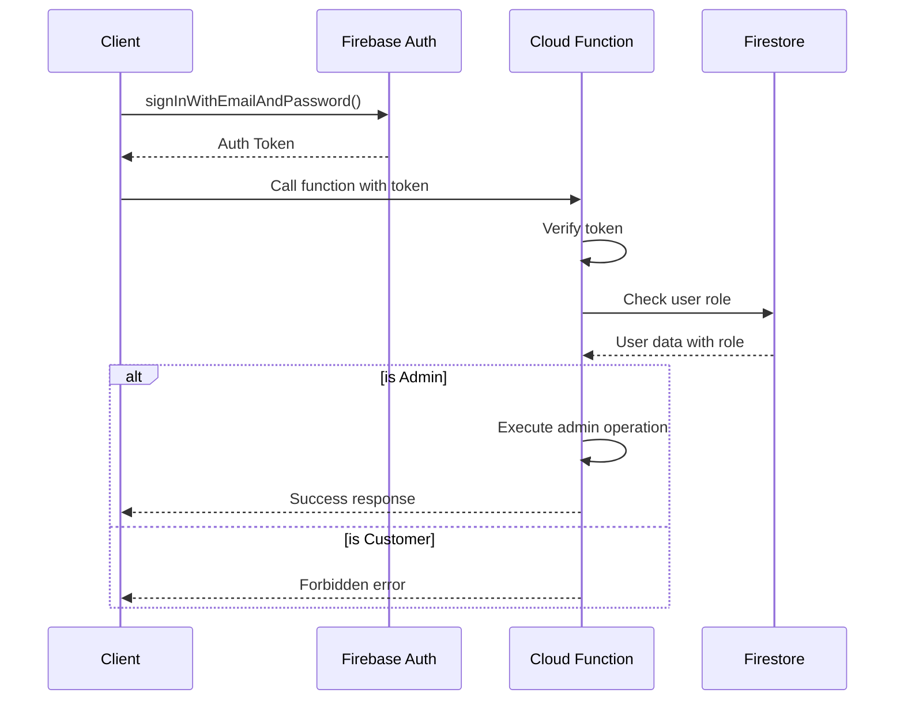

# Backend Architecture

## Service Architecture

### Function Organization

```
functions/
├── src/
│   ├── index.ts              # Function exports
│   ├── config/               # Configuration
│   │   ├── firebase.ts       # Firebase admin setup
│   │   └── stripe.ts         # Stripe configuration
│   ├── services/             # Business logic
│   │   ├── payment.service.ts
│   │   ├── order.service.ts
│   │   ├── inventory.service.ts
│   │   └── email.service.ts
│   ├── triggers/             # Firestore triggers
│   │   ├── order.triggers.ts
│   │   └── user.triggers.ts
│   ├── http/                 # HTTP endpoints
│   │   ├── stripe.ts         # Stripe webhooks
│   │   └── admin.ts          # Admin APIs
│   └── utils/                # Utilities
│       ├── validators.ts
│       └── errors.ts
├── lib/                      # Compiled output
└── package.json
```

### Function Template

```typescript
// functions/src/http/stripe.ts
import * as functions from 'firebase-functions';
import { stripe } from '../config/stripe';
import { db } from '../config/firebase';
import { OrderService } from '../services/order.service';

export const createPaymentIntent = functions.https.onCall(
  async (data, context) => {
    // Verify user is authenticated
    if (!context.auth) {
      throw new functions.https.HttpsError(
        'unauthenticated',
        'Must be logged in to create payment intent'
      );
    }

    const { shippingAddress } = data;
    const userId = context.auth.uid;

    try {
      // Get user's cart
      const cartDoc = await db.collection('carts').doc(userId).get();
      if (!cartDoc.exists || !cartDoc.data()?.items?.length) {
        throw new functions.https.HttpsError(
          'failed-precondition',
          'Cart is empty'
        );
      }

      // Calculate totals
      const orderData = await OrderService.calculateOrderTotals(
        cartDoc.data().items,
        shippingAddress
      );

      // Create payment intent
      const paymentIntent = await stripe.paymentIntents.create({
        amount: orderData.total,
        currency: 'usd',
        metadata: {
          userId,
          orderData: JSON.stringify(orderData),
        },
      });

      // Create pending order
      const order = await OrderService.createPendingOrder({
        ...orderData,
        userId,
        stripePaymentIntentId: paymentIntent.id,
        shippingAddress,
      });

      return {
        clientSecret: paymentIntent.client_secret,
        orderId: order.id,
        amount: orderData.total,
      };
    } catch (error) {
      console.error('Payment intent creation failed:', error);
      throw new functions.https.HttpsError(
        'internal',
        'Failed to create payment intent'
      );
    }
  }
);

// Stripe webhook handler
export const handleStripeWebhook = functions.https.onRequest(
  async (req, res) => {
    const sig = req.headers['stripe-signature'];
    const endpointSecret = functions.config().stripe.webhook_secret;

    try {
      const event = stripe.webhooks.constructEvent(
        req.rawBody,
        sig,
        endpointSecret
      );

      switch (event.type) {
        case 'payment_intent.succeeded':
          await OrderService.confirmOrder(event.data.object);
          break;
        case 'payment_intent.payment_failed':
          await OrderService.failOrder(event.data.object);
          break;
      }

      res.json({ received: true });
    } catch (err) {
      console.error('Webhook error:', err);
      res.status(400).send(`Webhook Error: ${err.message}`);
    }
  }
);
```

## Database Architecture

### Schema Design

```typescript
// functions/src/types/models.ts
import { Timestamp } from 'firebase-admin/firestore';

export interface Order {
  orderId: string;
  orderNumber: string;
  userId: string;
  status: OrderStatus;
  items: OrderItem[];
  subtotal: number;
  tax: number;
  shipping: number;
  total: number;
  shippingAddress: Address;
  billingAddress: Address;
  stripePaymentIntentId: string;
  estimatedDeliveryAt?: Timestamp;
  createdAt: Timestamp;
  updatedAt: Timestamp;
}

export interface InventoryTransaction {
  productId: string;
  quantity: number;
  type: 'reserve' | 'release' | 'confirm';
  orderId?: string;
  timestamp: Timestamp;
}

// Transaction example for inventory management
export async function updateInventoryWithTransaction(
  productId: string,
  quantityChange: number,
  orderId?: string
): Promise<void> {
  const productRef = db.collection('products').doc(productId);

  return db.runTransaction(async transaction => {
    const productDoc = await transaction.get(productRef);

    if (!productDoc.exists) {
      throw new Error('Product not found');
    }

    const currentInventory = productDoc.data().inventory;
    const newInventory = currentInventory + quantityChange;

    if (newInventory < 0) {
      throw new Error('Insufficient inventory');
    }

    transaction.update(productRef, {
      inventory: newInventory,
      updatedAt: Timestamp.now(),
    });

    // Log the inventory change
    const logRef = db.collection('inventoryLogs').doc();
    transaction.set(logRef, {
      productId,
      previousQuantity: currentInventory,
      newQuantity: newInventory,
      changeType: quantityChange < 0 ? 'order' : 'restock',
      referenceId: orderId,
      createdAt: Timestamp.now(),
      createdBy: 'system',
    });
  });
}
```

### Data Access Layer

```typescript
// functions/src/repositories/order.repository.ts
import { db } from '../config/firebase';
import { Order, OrderStatus } from '../types/models';
import { Timestamp } from 'firebase-admin/firestore';

export class OrderRepository {
  private collection = db.collection('orders');

  async create(
    orderData: Omit<Order, 'orderId' | 'createdAt' | 'updatedAt'>
  ): Promise<Order> {
    const orderRef = this.collection.doc();
    const order: Order = {
      ...orderData,
      orderId: orderRef.id,
      createdAt: Timestamp.now(),
      updatedAt: Timestamp.now(),
    };

    await orderRef.set(order);
    return order;
  }

  async updateStatus(
    orderId: string,
    status: OrderStatus,
    metadata?: any
  ): Promise<void> {
    const batch = db.batch();

    // Update order
    const orderRef = this.collection.doc(orderId);
    batch.update(orderRef, {
      status,
      updatedAt: Timestamp.now(),
    });

    // Create order event
    const eventRef = db.collection('orderEvents').doc();
    batch.set(eventRef, {
      orderId,
      previousStatus: (await orderRef.get()).data()?.status,
      newStatus: status,
      metadata,
      createdAt: Timestamp.now(),
      createdBy: 'system',
    });

    await batch.commit();
  }

  async getByUserId(userId: string, limit: number = 10): Promise<Order[]> {
    const snapshot = await this.collection
      .where('userId', '==', userId)
      .orderBy('createdAt', 'desc')
      .limit(limit)
      .get();

    return snapshot.docs.map(doc => doc.data() as Order);
  }
}
```

## Authentication and Authorization

### Auth Flow



### Middleware/Guards

```typescript
// functions/src/middleware/auth.middleware.ts
import * as functions from 'firebase-functions';
import { auth, db } from '../config/firebase';

export interface AuthContext {
  uid: string;
  email: string;
  role: 'customer' | 'admin';
}

export async function requireAuth(
  context: functions.https.CallableContext
): Promise<AuthContext> {
  if (!context.auth) {
    throw new functions.https.HttpsError(
      'unauthenticated',
      'Authentication required'
    );
  }

  const userDoc = await db.collection('users').doc(context.auth.uid).get();
  if (!userDoc.exists) {
    throw new functions.https.HttpsError('not-found', 'User profile not found');
  }

  return {
    uid: context.auth.uid,
    email: context.auth.token.email || '',
    role: userDoc.data()?.role || 'customer',
  };
}

export async function requireAdmin(
  context: functions.https.CallableContext
): Promise<AuthContext> {
  const authContext = await requireAuth(context);

  if (authContext.role !== 'admin') {
    throw new functions.https.HttpsError(
      'permission-denied',
      'Admin access required'
    );
  }

  return authContext;
}

// Usage example
export const adminAdjustInventory = functions.https.onCall(
  async (data, context) => {
    await requireAdmin(context);

    const { productId, adjustment, reason } = data;

    // Admin-only inventory adjustment logic
    await adjustInventory(productId, adjustment, reason);

    return { success: true };
  }
);
```
