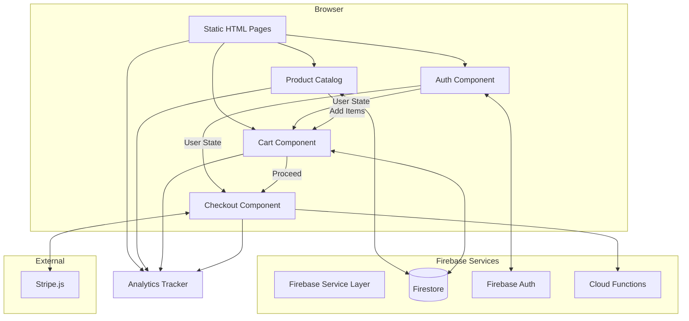

# Components

Based on our vanilla JavaScript architecture, here are the major logical components:

## Static Pages

**Responsibility:** Core HTML pages for the e-commerce experience

**Key Interfaces:**
- Load Firebase SDK and initialize app
- Import relevant JavaScript modules
- Provide semantic HTML structure

**Dependencies:** Firebase SDK, Tailwind CSS (CDN), Alpine.js (CDN)

**Technology Stack:** HTML5, ES6 modules, Progressive Enhancement

## Firebase Service Layer

**Responsibility:** Centralized Firebase operations and state management

**Key Interfaces:**
- `initializeFirebase()` - App initialization
- `getCurrentUser()` - Auth state
- `subscribeToAuth()` - Auth state changes
- `getFirestore()` - Database reference

**Dependencies:** Firebase SDK modules

**Technology Stack:** JavaScript ES6 modules, Firebase v9 modular SDK

## Authentication Component

**Responsibility:** Handle user authentication flows

**Key Interfaces:**
- `signInWithEmail(email, password)`
- `signInWithGoogle()`
- `signUp(email, password, displayName)`
- `signOut()`
- `onAuthStateChanged(callback)`

**Dependencies:** Firebase Auth, UI notification system

**Technology Stack:** Firebase Auth SDK, vanilla JS event handlers

## Product Catalog Component

**Responsibility:** Display and filter tea products

**Key Interfaces:**
- `loadProducts()` - Fetch active products
- `filterByCategory(category)` - Filter products
- `renderProductGrid(products)` - Display products
- `subscribeToInventory()` - Real-time stock updates

**Dependencies:** Firestore, Product Card component

**Technology Stack:** Vanilla JS, Web Components for product cards

## Shopping Cart Component

**Responsibility:** Manage cart state and operations

**Key Interfaces:**
- `addToCart(productId, quantity)`
- `updateCartItem(productId, newQuantity)`
- `removeFromCart(productId)`
- `getCartTotal()` - Calculate totals
- `subscribeToCart()` - Real-time cart sync

**Dependencies:** Firestore, Local Storage (for guests)

**Technology Stack:** Alpine.js for reactivity, Firestore real-time listeners

## Checkout Component

**Responsibility:** Handle payment processing flow

**Key Interfaces:**
- `initializeStripe()` - Load Stripe.js
- `createPaymentIntent()` - Call Cloud Function
- `confirmPayment()` - Process payment
- `saveShippingAddress()` - Store address

**Dependencies:** Stripe.js, Cloud Functions, Address validation

**Technology Stack:** Stripe Elements, Firebase Functions SDK

## Admin Dashboard

**Responsibility:** Order and inventory management

**Key Interfaces:**
- `loadOrders(filters)` - Fetch orders
- `updateOrderStatus(orderId, status)`
- `adjustInventory(productId, adjustment)`
- `exportOrders()` - Generate CSV

**Dependencies:** Admin Cloud Functions, Firestore

**Technology Stack:** Vanilla JS, HTML tables, Alpine.js for interactivity

## Analytics Tracker

**Responsibility:** Track user behavior and conversions

**Key Interfaces:**
- `trackPageView(page)`
- `trackEvent(eventType, eventData)`
- `trackConversion(orderId, revenue)`
- `getSessionId()` - Maintain session

**Dependencies:** Firebase Analytics, Custom analytics collection

**Technology Stack:** Firebase Analytics SDK, Firestore for custom events

## Component Interaction Diagram

