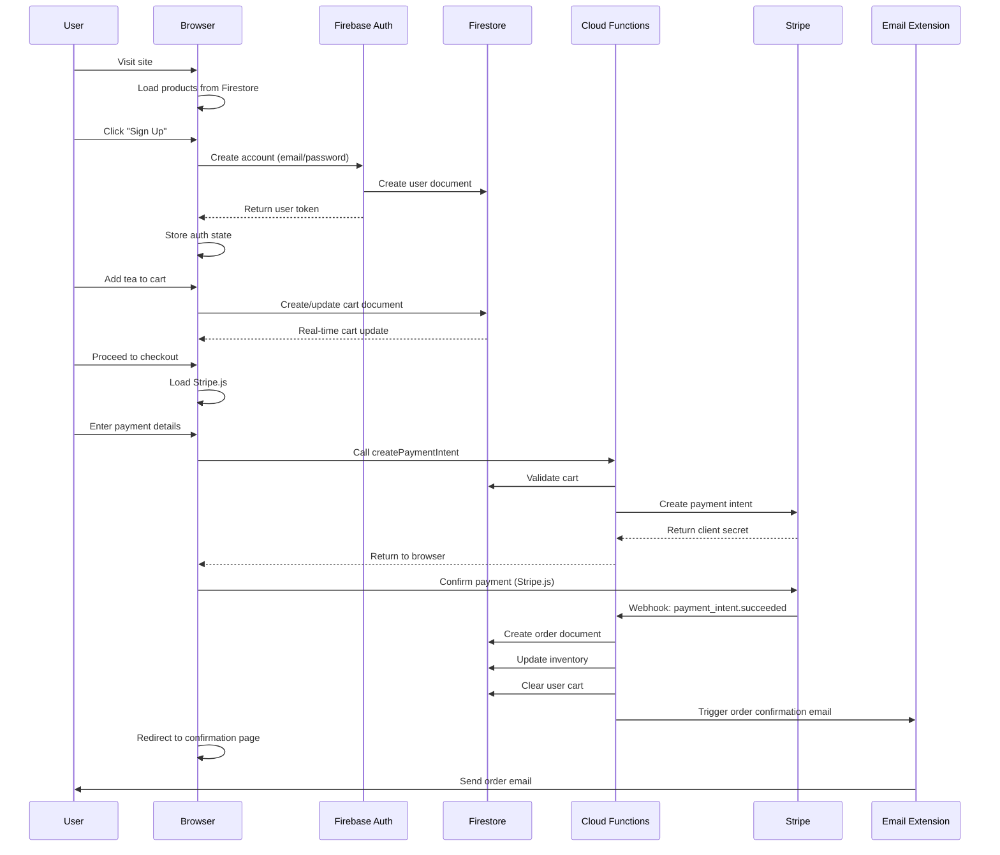
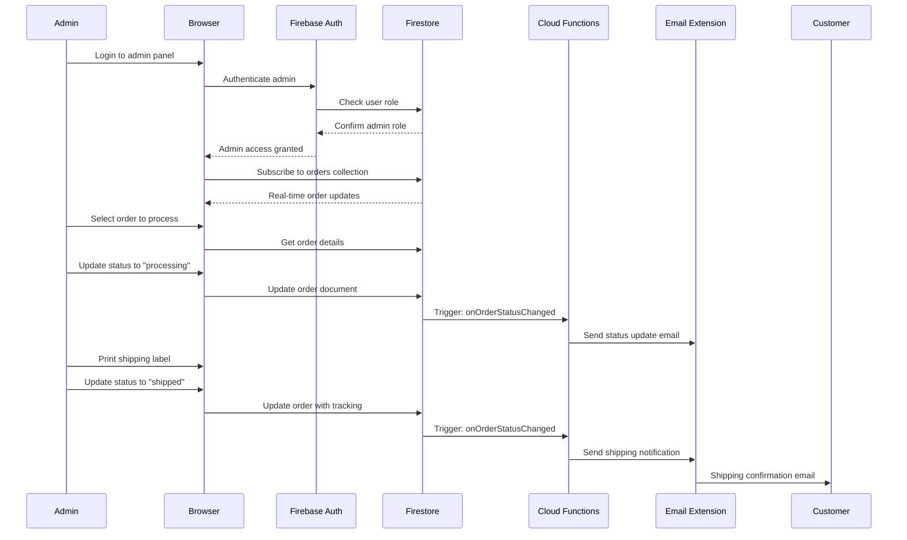
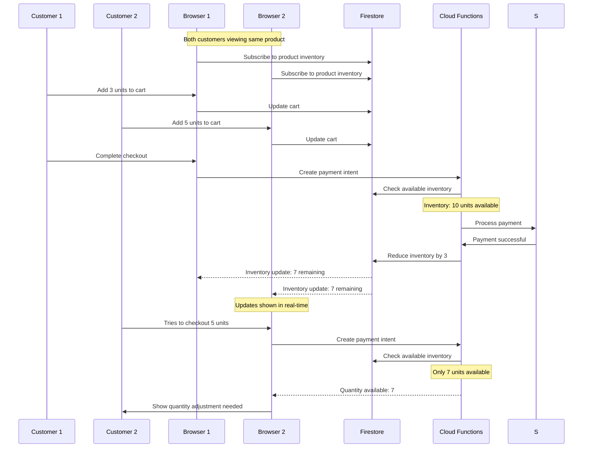
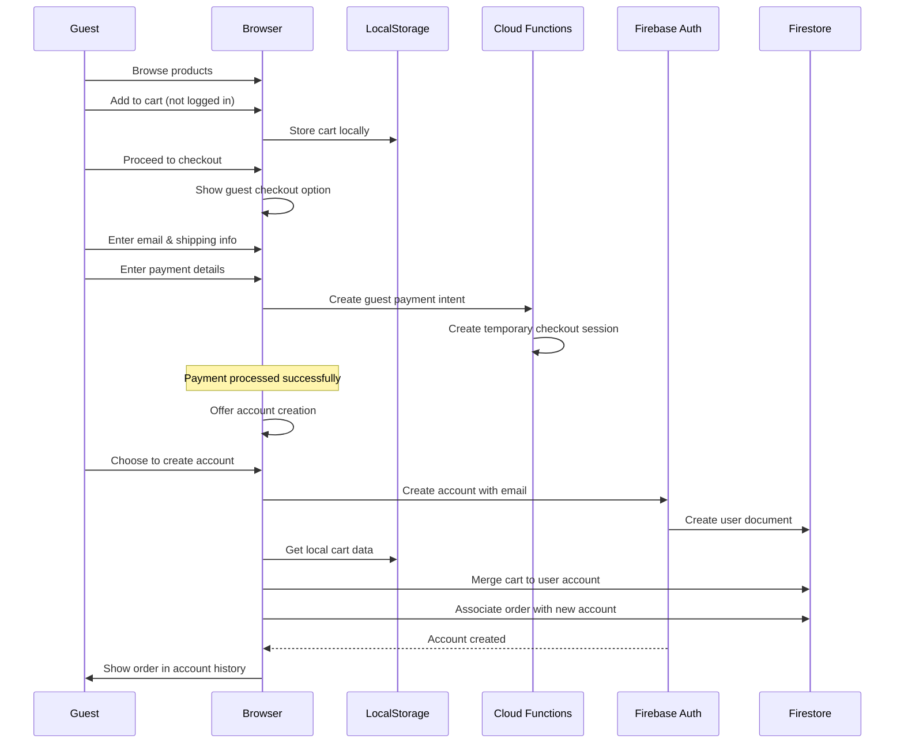

# Core Workflows

Here are the critical user journeys illustrated with sequence diagrams:

## User Registration and First Purchase Flow

## Admin Order Management Flow

## Real-time Inventory Management

## Guest Checkout with Account Creation

