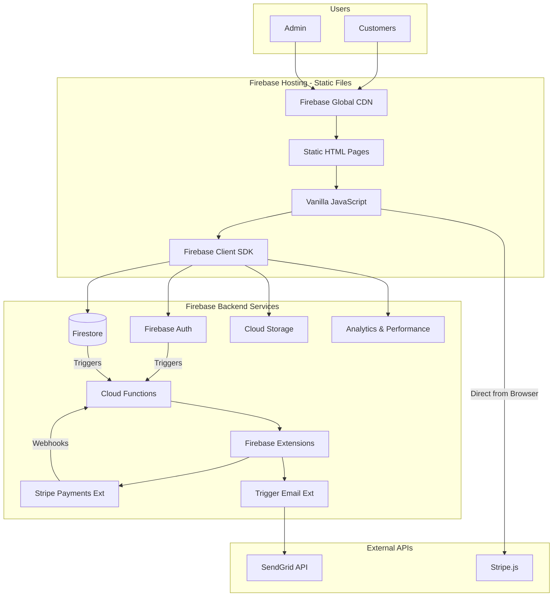

# High Level Architecture

## Technical Summary

The Vita-Tea MVP adopts a pure serverless, static-first architecture using vanilla HTML/CSS/JavaScript deployed directly to Firebase Hosting. The platform leverages the complete Firebase ecosystem including Authentication, Firestore, Cloud Storage, Analytics, and Cloud Functions, with Firebase Extensions for Stripe payments and transactional emails. This ultra-simplified architecture enables deployment within minutes and rapid iteration, perfectly aligned with the 8-10 week timeline and 50+ orders goal, while eliminating build complexity and reducing potential points of failure.

## Platform and Infrastructure Choice

Based on PRD requirements and MVP goals, here's the platform analysis:

**Selected Platform: Firebase Platform (All-in-one)**

**Rationale**: 
- Zero build step = faster development and deployment
- Static hosting with CDN included
- All Firebase services accessible via client SDK
- Generous free tier perfect for MVP launch
- Firebase Extensions eliminate custom backend code

**Key Services:**
- Firebase Hosting (static files + CDN)
- Firestore (multi-region for reliability)
- Authentication (Email/Password + Google)
- Cloud Functions (payment processing, order fulfillment)
- Cloud Storage (product images, assets)
- Firebase Analytics & Performance Monitoring
- Firebase Extensions:
  - Trigger Email with SendGrid
  - Run Stripe Payments
  - Resize Images

**Deployment Host and Regions:** 
- Hosting: Global CDN via Firebase
- Functions: us-central1
- Firestore: Multi-region (nam5) for 99.999% availability

## Repository Structure

**Structure:** Single Repository (MVP-optimized)
**Build Tool:** None - Pure static files
**Package Organization:**
```
vita-tea-mvp/
├── public/               # All static files served by Firebase
│   ├── index.html       # Homepage
│   ├── shop.html        # Product catalog
│   ├── product.html     # Product detail page
│   ├── cart.html        # Shopping cart
│   ├── checkout.html    # Checkout flow
│   ├── admin/           # Admin pages
│   │   ├── index.html   # Admin dashboard
│   │   ├── orders.html  # Order management
│   │   └── inventory.html # Inventory management
│   ├── css/
│   │   ├── main.css     # Main styles (Tailwind via CDN)
│   │   └── admin.css    # Admin-specific styles
│   ├── js/
│   │   ├── app.js       # Main application logic
│   │   ├── firebase-config.js # Firebase initialization
│   │   ├── auth.js      # Authentication logic
│   │   ├── products.js  # Product catalog logic
│   │   ├── cart.js      # Cart management
│   │   ├── checkout.js  # Checkout flow
│   │   └── components/  # Reusable JS components
│   │       ├── product-card.js
│   │       └── cart-item.js
│   └── assets/          # Images, fonts, etc.
├── functions/           # Cloud Functions
│   ├── src/
│   │   ├── index.ts     # Function exports
│   │   ├── stripe.ts    # Stripe webhook handlers
│   │   └── admin.ts     # Admin API endpoints
│   └── package.json
├── firestore.rules      # Security rules
├── storage.rules        # Storage security rules
├── firebase.json        # Firebase configuration
└── .firebaserc         # Project configuration
```

## High Level Architecture Diagram



## Architectural Patterns

- **Static-First Architecture:** Pure HTML/CSS/JS with no build step - _Rationale:_ Instant deployments, zero configuration, maximum simplicity
- **Direct Firebase SDK Integration:** Client-side Firebase operations with security rules - _Rationale:_ Real-time updates, minimal backend code
- **Progressive Enhancement:** Basic HTML works without JS, enhanced with JS - _Rationale:_ Better accessibility and SEO
- **Web Components:** Vanilla JS custom elements for reusability - _Rationale:_ Native browser API, no framework needed
- **Event-Driven Background Tasks:** Cloud Functions for async operations - _Rationale:_ Handle payments and fulfillment server-side
- **Security Rules as Business Logic:** All access control in Firestore rules - _Rationale:_ Declarative security, no custom auth code
